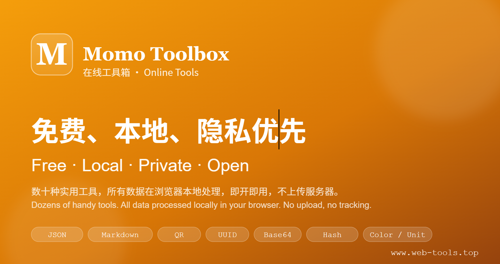

# Momo工具箱 · Momo Toolbox

<p align="center">
  
</p>

> 极速、专业的在线工具集合 · 所有数据浏览器本地处理 · 即开即用 · 保护隐私

**站点**: https://www.web-tools.top

## 特性

- **隐私优先** — 所有工具数据在浏览器本地处理，不上传服务器
- **极速体验** — Astro 静态站点架构，按需 hydrate，加载如闪电
- **温暖设计** — 琥珀橙主色 + 柔和米色背景，告别冷冰冰的工具界面
- **基础工具永久免费** — 无需注册、无付费墙
- **中英双语** — 原生 i18n 支持，跨组件同步切换

## 技术栈

- **框架**: Astro 5.18 (Islands 架构，静态优先)
- **交互**: React 19 (仅在需要交互的组件上 hydrate)
- **样式**: Tailwind CSS v4 (原子化 CSS，零运行时开销)
- **部署**: Cloudflare Pages (全球 CDN 加速)

## 工具列表 (13 个)

| 类别 | 工具 |
|------|------|
| 开发者 | JSON 格式化、Base64、URL 编解码、时间戳、哈希、JWT 解码、UUID/ULID |
| 文本 | Markdown 编辑器 |
| 图像 | 图片压缩 |
| 生产力 | 二维码生成、密码生成器、颜色转换、单位换算 |

## 本地开发

```bash
npm install
npm run dev
```

访问 http://localhost:4321/

## 构建

```bash
npm run build
```

输出在 `dist/` 目录。

## 联系

邮箱: 1902243211@qq.com

## 许可

© Momo Toolbox. 工具处理产生的内容归用户所有。
